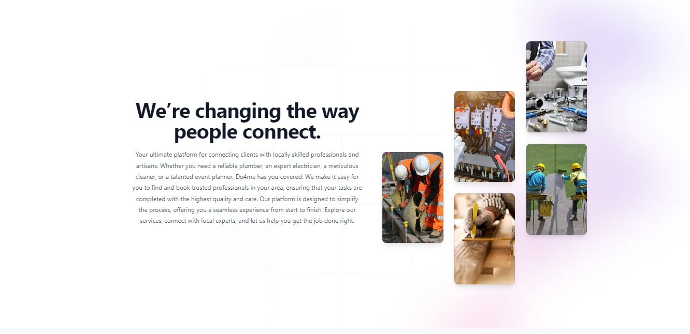

# Project Name

## About

[The about section of the D94me project.]

## Getting Started

### Prerequisites

- Ensure you have [Node.js](https://nodejs.org/) installed.
- Install dependencies by running:

  ```bash
  npm install
  ```

### Running the App

1. Clone the repository:

   ```bash
   git clone [repository URL]
   cd [project directory]
   ```

2. Start the development server:

   ```bash
   npm start
   ```

3. Open your browser and navigate to:

   ```
   http://localhost:3000
   ```

   to view the app.

### Building for Production

To create a production build, run:

```bash
npm run build
```

This will generate optimized files in the `build` directory.

### Additional Notes

- Make sure to configure any necessary environment variables in a `.env` file.
- Refer to the `package.json` for additional scripts.

## Screenshot

